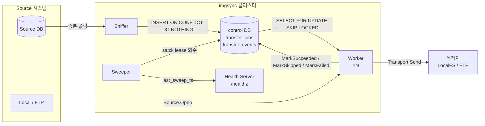

# 아키텍처

imgsync 의 전체 구조와 데이터 흐름을 설명합니다.

## 컴포넌트 다이어그램



## 데이터 흐름 4단계

### 1. Enqueue

Sniffer 가 Source DB 에서 새 레코드를 감지하면 control DB 에 작업을 등록합니다.

- SQL: `INSERT INTO transfer_jobs ... ON CONFLICT (trace_id, dst) DO NOTHING`
- Go: `repo.Enqueue`
- 결과: `status = 'pending'`, `transfer_events` 에 `enqueue` 이벤트 삽입

### 2. Lease

Worker 가 다음 처리할 작업을 원자적으로 점유합니다.

- SQL: `SELECT ... FOR UPDATE SKIP LOCKED` — 동시에 여러 워커가 같은 행을 잡지 않도록 보장
- Go: `repo.LeaseOne`
- 결과: `status = 'leased'`, `locked_by`, `locked_at` 세팅, `transfer_events` 에 `lease` 이벤트 삽입

### 3. Execute

Worker 가 소스에서 스트림을 열고 목적지로 전송합니다.

- `Source.Open(ctx, src)` → `io.ReadCloser` 반환
- `Transport.Send(ctx, dst, body, expectedSize)` → 쓴 바이트 수 + SHA-256 반환
- 전체 본문을 메모리에 버퍼링하지 않음 — 스트림 직접 파이프

### 4. Finalize

전송 결과에 따라 작업 상태를 확정합니다.

- 성공 → `MarkSucceeded` → `status = 'succeeded'`, `transfer_events` 에 `success` 이벤트
- 소스 부재(`ErrSkippable`) → `MarkSkipped` → `status = 'skipped'`, `transfer_events` 에 `skip` 이벤트
- 일반 오류 → `MarkFailed` → `attempts` 증가, `last_error` 기록, `transfer_events` 에 `fail` 이벤트. `max_attempts` 초과 시 `status = 'dead'`

## 장애 / 동시성 모델

DB 가 단일 source of truth 입니다. 워커는 완전히 stateless — 어느 파드든 재시작해도 DB 상태만 보면 됩니다. Sweeper 가 안전망 역할을 해서, 임의 이유로 워커가 죽어 lease 가 방치된 경우 threshold(기본 5분) 이후 `pending` 으로 되돌립니다. Sniffer 와 Sweeper 는 각각 PostgreSQL `pg_try_advisory_lock` 기반 advisory lock 으로 클러스터 전체에서 단일 리더만 동작하도록 보장합니다. `replicaCount > 1` 이어도 두 컴포넌트가 중복 실행되는 일은 없습니다.

## 확장 포인트

새 스토리지 백엔드를 붙이려면 아래 두 인터페이스 중 하나(또는 둘 다)를 구현하면 됩니다.

```go
// internal/transfer/interfaces.go
type Source interface {
    Open(ctx context.Context, src string) (body io.ReadCloser, size int64, err error)
}

type Transport interface {
    Send(ctx context.Context, dst string, body io.Reader, expectedSize int64) (
        writtenBytes int64, sha256Hex string, err error)
}
```

구현체는 `internal/sources/<protocol>/` 또는 `internal/transports/<protocol>/` 아래에 배치하고, Worker 의 프로토콜 레지스트리에 등록합니다. DB 스키마나 Worker 루프를 건드릴 필요가 없습니다. 전체 계약(에러 정책, 스트리밍 규칙)은 [Source · Transport](sources-and-transports.md) 에서 다룹니다.

## 의도적으로 하지 않은 것

imgsync 는 **분산 락 전용 서비스**(예: etcd, Zookeeper)와 **메시지 브로커**(예: Kafka, RabbitMQ)를 사용하지 않습니다. `transfer_jobs` + `transfer_events` 두 테이블만으로 enqueue / lease / finalize / audit 이 모두 해결됩니다. 외부 인프라 의존성을 최소화해 ops 를 단순하게 유지하는 것이 설계 목표입니다.
