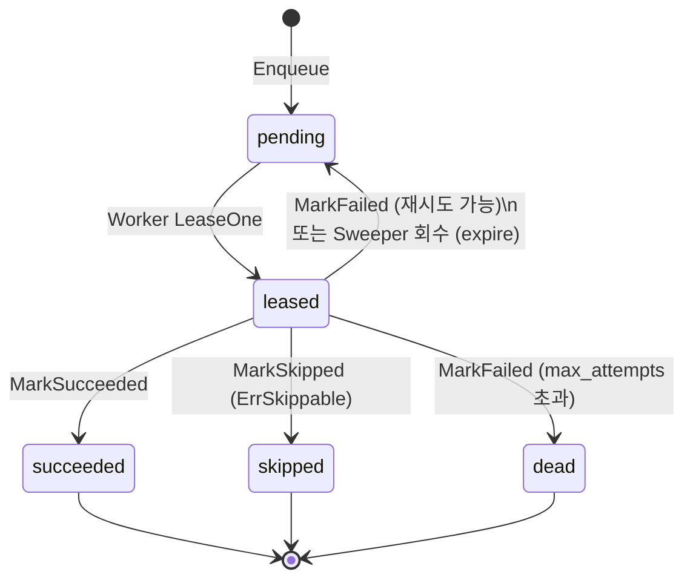

# 작업 큐 모델

imgsync 의 "Two-Table Minimal" 큐 설계를 설명합니다.

## Two-Table Minimal 이란

작업 하나는 `transfer_jobs` 의 **행 하나**로 표현됩니다. 해당 작업에서 일어난 모든 이벤트(enqueue, lease, success, fail …)는 `transfer_events` 에 **N 개의 행**으로 쌓입니다. 메시지 브로커나 별도 큐 엔진 없이 두 테이블만으로 enqueue / lease / finalize / audit 을 모두 처리합니다. 자세한 아키텍처 맥락은 [아키텍처](architecture.md) 를 참고하세요.

## `transfer_jobs` 컬럼

| 컬럼 | 타입 | 의미 | 변경 시점 |
|---|---|---|---|
| `id` | bigserial | PK | INSERT 시 자동 |
| `trace_id` | text | 외부 부여 작업 단위 식별자 | INSERT 시 |
| `src` | text | 소스 경로 (URI 형식) | INSERT 시 |
| `dst` | text | 목적지 경로 (URI 형식) | INSERT 시 |
| `src_protocol` | text | 소스 프로토콜 (`localfs`, `ftp` 등) | INSERT 시 |
| `dst_protocol` | text | 목적지 프로토콜 (`localfs`, `ftp` 등) | INSERT 시 |
| `status` | text | 현재 상태 (`pending` / `leased` / `succeeded` / `skipped` / `dead`) | 상태 전이마다 |
| `attempts` | int | 지금까지 시도된 횟수 | lease 마다 +1, MarkFailed 시 반영 |
| `max_attempts` | int | 최대 재시도 횟수. 초과 시 `dead` | INSERT 시 (기본값 적용) |
| `locked_by` | text | lease 중인 워커 식별자 | LeaseOne 시 세팅, 해제 시 NULL |
| `locked_at` | timestamptz | lease 획득 시각 | LeaseOne 시 세팅, 해제 시 NULL |
| `last_error` | text | 가장 최근 실패 에러 메시지 | MarkFailed 시 |
| `created_at` | timestamptz | 행 생성 시각 | INSERT 시 자동 |
| `updated_at` | timestamptz | 마지막 변경 시각 | 모든 UPDATE 시 자동 |

## `transfer_events` 컬럼

| 컬럼 | 타입 | 의미 |
|---|---|---|
| `id` | bigserial | PK |
| `job_id` | bigint | `transfer_jobs.id` FK |
| `status` | text | 이벤트 종류 (`enqueue`, `lease`, `success`, `skip`, `fail`, `expire`, `dead`) |
| `ts` | timestamptz | 이벤트 발생 시각 |
| `detail` | text | 에러 메시지 또는 부가 정보 (nullable) |

## 상태 전이도



`leased → pending` 경로는 두 가지입니다.

1. **일시적 오류 후 재큐**: Worker 가 `MarkFailed` 를 호출하고 `attempts < max_attempts` 이면 `status` 를 `pending` 으로 돌립니다.
2. **Sweeper 회수**: Worker 가 crash 등으로 finalze 하지 못한 채 `locked_at` 이 threshold(5분)를 넘으면 Sweeper 가 `expire` 이벤트를 기록하고 `pending` 으로 되돌립니다.

## 멱등성 키

`transfer_jobs` 에는 `(trace_id, dst)` UNIQUE constraint 가 있습니다. `repo.Enqueue` 는 `INSERT ... ON CONFLICT (trace_id, dst) DO NOTHING` 으로 구현돼 있어서, 동일한 `(trace_id, dst)` 로 enqueue 를 여러 번 호출해도 행이 하나만 생성됩니다. Sniffer 가 재시작되거나 source DB 에서 같은 레코드를 두 번 읽어도 중복 작업이 만들어지지 않습니다.

## 운영자가 자주 쓰는 SQL

**단일 작업 감사** (runbook §2):

```sql
SELECT j.id, j.status, j.attempts, e.status AS event, e.ts, e.detail
  FROM transfer_jobs j LEFT JOIN transfer_events e ON j.id = e.job_id
 WHERE j.trace_id = '<trace>' AND j.dst = '<dst>'
 ORDER BY e.ts;
```

**갇힌 작업 찾기** (runbook §3):

```sql
SELECT id, trace_id, locked_by, locked_at, NOW() - locked_at AS held_for
  FROM transfer_jobs
 WHERE status = 'leased'
   AND locked_at < NOW() - INTERVAL '5 minutes'
 ORDER BY locked_at;
```

**상태별 카운트**:

```sql
SELECT status, count(*) FROM transfer_jobs GROUP BY status;
```
