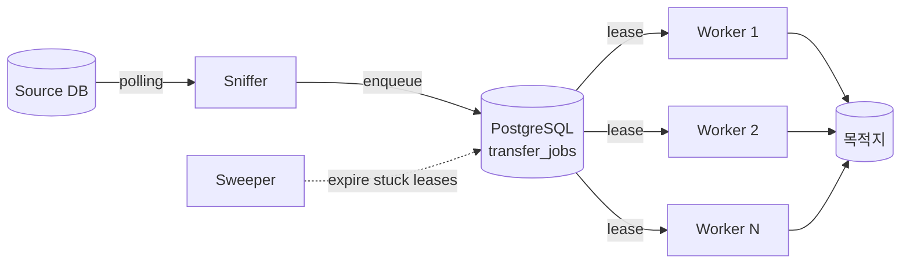

# imgsync

**Go + PostgreSQL 기반 파일 전송 작업 큐.**
사내 NiFi 파이프라인을 대체하기 위해 만든, 끊김 없는 대량 파일 전송용 워커 시스템.

➡️ [5분 안에 시작하기](getting-started/quickstart-docker-compose.md) · [운영 런북](operating/runbook.md)

## 무엇을 해결하나

- **대량 파일 전송**의 끊김 없는 처리 — 워커가 죽어도 sweeper 가 lease 를 회수하고 재시도한다.
- **파일 단위 traceability** — 모든 작업이 `transfer_jobs` / `transfer_events` 두 테이블에 기록된다.
- **FTP 세션 재사용** — 동일 호스트에 대한 세션 풀로 핸드셰이크 오버헤드 제거.
- **Worker scale-out** — 워커는 stateless. DB 가 큐. `replicaCount` 만 늘리면 처리량이 선형 증가.

## 누가 쓰나

| 역할 | 설명 | 시작 페이지 |
|---|---|---|
| **Operator** | Helm 으로 클러스터에 배포하고, 작업이 막혔을 때 SQL 한 줄로 원인을 찾는 사람. | [→ 운영 가이드](operating/index.md) |
| **Integrator** | DB 의 작업 목록을 imgsync 큐로 흘려보내거나, 새 Source / Transport 를 붙이는 사람. | [→ Sniffer 설정](configuration/sniffer.md) |
| **Contributor** | 코어 워커 / sweeper 를 고치거나, 새 프로토콜을 구현하는 사람. | [→ 개발 가이드](developer/index.md) |

## 핵심 개념 한눈에

자세한 동작은 [아키텍처](concepts/architecture.md), 데이터 모델은 [작업 큐 모델](concepts/job-queue-model.md) 참고.

## 다음 단계

- 처음이라면: [Docker Compose 빠른 시작](getting-started/quickstart-docker-compose.md)
- 클러스터에 올리려면: [Helm 설치](installation/helm.md)
- 설정 항목 전체: [환경 변수](configuration/environment-variables.md), [values.yaml 레퍼런스](installation/values-reference.md)
- 자주 묻는 질문: [FAQ](faq.md) — 설계 / 운영 / 마이그레이션 / 확장 관련 빠른 답변.
