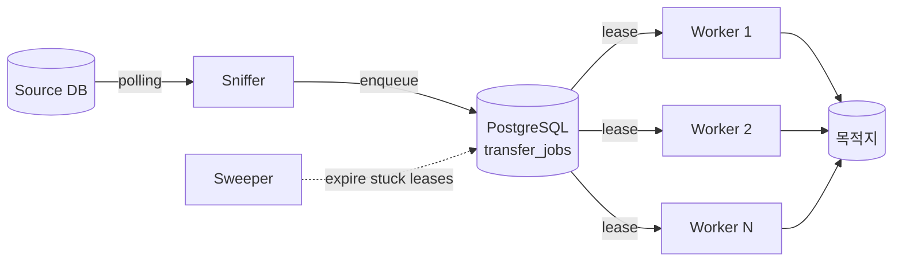

# imgsync 공식 가이드 사이트 구축 Implementation Plan

> **For agentic workers:** REQUIRED SUB-SKILL: Use superpowers:subagent-driven-development (recommended) or superpowers:executing-plans to implement this plan task-by-task. Steps use checkbox (`- [ ]`) syntax for tracking.

**Goal:** imgsync(사내 NiFi 대체 Go+PostgreSQL 작업 큐)의 공식 홈페이지 수준 사용자 가이드 사이트를 MkDocs Material로 구축하고 GitHub Pages 로 배포한다.

**Architecture:** 기존 `docs/` 디렉토리를 MkDocs 입력 디렉토리로 그대로 사용한다. 루트에 `mkdocs.yml`, GitHub Actions 워크플로우, `requirements-docs.txt`, `make docs-*` 타겟을 추가한다. 정보 아키텍처는 **Operator > Integrator > Contributor** 순. 기존 `docs/runbook.md`·`docs/e2e-manual-guide.md`는 새 위치로 이동·흡수한다(이동 후 README 등 참조 링크 갱신). 모든 콘텐츠는 한국어. 코드 예제와 명령어는 그대로 영어/원문 유지.

**Tech Stack:**
- MkDocs 1.6+ + `mkdocs-material` (Material for MkDocs)
- 플러그인: `mkdocs-material[imaging]` (소셜 카드), `mkdocs-mermaid2-plugin` (다이어그램), `mkdocs-linkcheck` (링크 검증, CI에서만)
- Python 3.12 (CI), 로컬은 시스템 python3 + venv 권장
- GitHub Pages (`gh-pages` 브랜치), GitHub Actions

---

## File Structure

### 신규 파일 (인프라)

| 경로 | 책임 |
|---|---|
| `mkdocs.yml` | 사이트 설정(theme, nav, plugins, markdown_extensions) |
| `requirements-docs.txt` | docs 빌드 전용 Python 의존성 핀 |
| `.github/workflows/docs.yml` | `main` push 시 mkdocs build → gh-pages 배포 |
| `.gitignore` (수정) | `site/` 추가 |
| `Makefile` (수정) | `docs-install` / `docs-serve` / `docs-build` / `docs-linkcheck` 타겟 |
| `docs/.overrides/partials/footer.html` | (선택) 푸터 커스터마이즈 — 없으면 기본 푸터 |

### 신규 콘텐츠 파일 (모두 `docs/` 하위)

```
docs/
├── index.md                          # 랜딩
├── getting-started/
│   ├── index.md                      # 5분 컨셉 요약 + 진입점 분기
│   ├── quickstart-docker-compose.md  # 로컬 dev 스택 (5분)
│   └── quickstart-kind.md            # kind+helm (15분)
├── concepts/
│   ├── index.md
│   ├── architecture.md               # 컴포넌트/데이터 흐름 (Mermaid)
│   ├── job-queue-model.md            # Two-Table Minimal 스키마
│   ├── components.md                 # Worker / Sniffer / Sweeper 역할
│   ├── sources-and-transports.md     # Source/Transport 인터페이스, 프로토콜 매트릭스
│   └── glossary.md
├── installation/
│   ├── index.md                      # 배포 토폴로지 개요
│   ├── helm.md                       # 단계별 Helm 설치
│   ├── secrets.md                    # imgsync-dsn / imgsync-ftp / sniffer secrets
│   └── values-reference.md           # values.yaml 풀 reference (자동 생성 권장)
├── configuration/
│   ├── index.md
│   ├── environment-variables.md      # IMGSYNC_* 전체 표
│   ├── worker.md                     # workers/idle/ftp pool 튜닝
│   ├── sniffer.md                    # source DB / pattern / shadow / batch
│   ├── sweeper.md                    # threshold/interval
│   └── protocols.md                  # FTP / S3(예정) / localfs 매트릭스
├── cli/
│   ├── index.md                      # 서브커맨드 개요
│   ├── migrate.md
│   ├── worker.md
│   ├── sniffer.md
│   └── enqueue.md
├── operating/
│   ├── index.md
│   ├── runbook.md                    # ← 기존 docs/runbook.md 흡수+확장
│   ├── monitoring.md                 # /healthz, /livez, /readyz, 메트릭/로그
│   ├── scaling.md                    # replicaCount, hostcap, FTP 튜닝
│   ├── upgrades-and-rollback.md      # 마이그레이션 forward-only, 롤백 절차
│   └── troubleshooting.md            # 증상 → 진단 → 조치 매트릭스
├── developer/
│   ├── index.md
│   ├── build-and-test.md             # make ci, race, integration tags
│   ├── architecture-deep-dive.md     # 패키지 맵, 인터페이스 경계
│   ├── e2e-manual.md                 # ← 기존 docs/e2e-manual-guide.md 흡수
│   ├── contributing.md               # 코딩 스타일, golangci-lint, streaming guard
│   └── release-process.md            # 버전 산출, Helm chart bump
├── faq.md
└── reference/
    └── changelog.md                  # 버전별 변경(향후)
```

### 이동/제거

- `docs/runbook.md` → `docs/operating/runbook.md`로 이동 + 본문 확장. 루트 README의 링크를 갱신한다.
- `docs/e2e-manual-guide.md` → `docs/developer/e2e-manual.md`로 이동. 기존 본문은 그대로 보존하되, MkDocs 트리에 맞춘 frontmatter(`title:`)와 상호 링크만 추가한다.

### 보존

- `docs/superpowers/`(plans/specs)는 빌드 대상에서 제외(`exclude_docs`로 처리). 사내 작업 계획이 공개 사이트에 노출되지 않도록 한다.

---

## 작업 원칙

- 각 Task는 한 섹션 단위로 묶었다. 섹션 내부에서는 페이지를 한 번에 한 개 작성 → `mkdocs build --strict` 통과 확인 → 커밋의 사이클을 반복한다.
- "공식 홈페이지 수준"의 기준은 다음 5가지이다. 모든 페이지가 이 다섯을 충족해야 한다.
  1. **첫 화면에서 무엇/왜/누가 사용하는지가 보일 것** (랜딩/섹션 index)
  2. **Quickstart는 복붙 5분 안에 동작할 것** (실제 Makefile 타겟과 일치)
  3. **모든 설정 항목이 한 곳에 표로 모일 것** (env / values.yaml / CLI flags)
  4. **운영 시나리오별 절차가 있을 것** (runbook + troubleshooting)
  5. **빌드/링크 체크가 CI에서 깨지면 빨간 불일 것** (`mkdocs build --strict`)
- TDD-스타일 검증: 페이지를 쓸 때마다 `make docs-build`(== `mkdocs build --strict`)가 warning 없이 통과해야 한다. `--strict`는 깨진 링크·레퍼런스를 빌드 실패로 만든다.

---

## Task 1: MkDocs 인프라 부트스트랩

**Files:**
- Create: `mkdocs.yml`
- Create: `requirements-docs.txt`
- Create: `.github/workflows/docs.yml`
- Create: `docs/index.md` (placeholder만)
- Modify: `Makefile`
- Modify: `.gitignore`

### Step 1: 의존성 핀 작성

- [ ] **Step 1.1: `requirements-docs.txt` 작성**

```
mkdocs==1.6.1
mkdocs-material==9.5.44
mkdocs-mermaid2-plugin==1.2.1
pymdown-extensions==10.11.2
```

핀은 작성 시점 기준 안정 버전. 빌드가 깨지면 `pip install -U mkdocs-material` 후 핀을 갱신한다.

### Step 2: `mkdocs.yml` 작성

- [ ] **Step 2.1: `mkdocs.yml` 작성**

```yaml
site_name: imgsync
site_description: Go + PostgreSQL 기반 파일 전송 작업 큐. 사내 NiFi 대체.
site_url: https://nineking424.github.io/imgsync/
repo_url: https://github.com/nineking424/imgsync
repo_name: nineking424/imgsync
edit_uri: edit/main/docs/
docs_dir: docs
site_dir: site
strict: true

# 사내 작업 산출물은 공개 사이트에서 제외
exclude_docs: |
  superpowers/
  README.md

theme:
  name: material
  language: ko
  palette:
    - media: "(prefers-color-scheme: light)"
      scheme: default
      primary: indigo
      accent: indigo
      toggle:
        icon: material/brightness-7
        name: 다크 모드로 전환
    - media: "(prefers-color-scheme: dark)"
      scheme: slate
      primary: indigo
      accent: indigo
      toggle:
        icon: material/brightness-4
        name: 라이트 모드로 전환
  features:
    - navigation.tabs
    - navigation.tabs.sticky
    - navigation.sections
    - navigation.indexes
    - navigation.top
    - navigation.tracking
    - toc.follow
    - search.suggest
    - search.highlight
    - content.code.copy
    - content.code.annotate
    - content.action.edit
  icon:
    repo: fontawesome/brands/github

plugins:
  - search:
      lang:
        - ko
        - en
  - mermaid2

markdown_extensions:
  - admonition
  - attr_list
  - def_list
  - footnotes
  - md_in_html
  - tables
  - toc:
      permalink: true
      toc_depth: 3
  - pymdownx.details
  - pymdownx.superfences:
      custom_fences:
        - name: mermaid
          class: mermaid
          format: !!python/name:mermaid2.fence_mermaid_custom
  - pymdownx.tabbed:
      alternate_style: true
  - pymdownx.snippets
  - pymdownx.highlight:
      anchor_linenums: true
      line_spans: __span
      pygments_lang_class: true
  - pymdownx.inlinehilite
  - pymdownx.tasklist:
      custom_checkbox: true

extra:
  social:
    - icon: fontawesome/brands/github
      link: https://github.com/nineking424/imgsync

nav:
  - 소개: index.md
  - 시작하기:
      - getting-started/index.md
      - Docker Compose 빠른 시작: getting-started/quickstart-docker-compose.md
      - kind + Helm 빠른 시작: getting-started/quickstart-kind.md
  - 개념:
      - concepts/index.md
      - 아키텍처: concepts/architecture.md
      - 작업 큐 모델: concepts/job-queue-model.md
      - 컴포넌트: concepts/components.md
      - Source · Transport: concepts/sources-and-transports.md
      - 용어집: concepts/glossary.md
  - 설치:
      - installation/index.md
      - Helm 설치: installation/helm.md
      - Secret 준비: installation/secrets.md
      - values.yaml 레퍼런스: installation/values-reference.md
  - 설정:
      - configuration/index.md
      - 환경 변수: configuration/environment-variables.md
      - Worker: configuration/worker.md
      - Sniffer: configuration/sniffer.md
      - Sweeper: configuration/sweeper.md
      - 프로토콜: configuration/protocols.md
  - CLI:
      - cli/index.md
      - migrate: cli/migrate.md
      - worker: cli/worker.md
      - sniffer: cli/sniffer.md
      - enqueue: cli/enqueue.md
  - 운영:
      - operating/index.md
      - 런북: operating/runbook.md
      - 모니터링: operating/monitoring.md
      - 스케일링: operating/scaling.md
      - 업그레이드 · 롤백: operating/upgrades-and-rollback.md
      - 트러블슈팅: operating/troubleshooting.md
  - 개발:
      - developer/index.md
      - 빌드와 테스트: developer/build-and-test.md
      - 아키텍처 심화: developer/architecture-deep-dive.md
      - E2E 매뉴얼: developer/e2e-manual.md
      - 기여 가이드: developer/contributing.md
      - 릴리스 프로세스: developer/release-process.md
  - FAQ: faq.md
```

### Step 3: 임시 placeholder `docs/index.md`

- [ ] **Step 3.1: `docs/index.md` placeholder 작성** — Task 2에서 본격 채움

```markdown
# imgsync

> Go + PostgreSQL 기반 파일 전송 작업 큐.

이 페이지는 Task 2에서 채워집니다.
```

### Step 4: Makefile 타겟

- [ ] **Step 4.1: `Makefile` 끝에 docs 타겟 추가**

```makefile
docs-install: ## docs 빌드 의존성 설치 (venv 권장)
	pip install -r requirements-docs.txt

docs-serve: ## 로컬 라이브 미리보기 (http://localhost:8000)
	mkdocs serve --strict

docs-build: ## 정적 사이트 빌드 (--strict, 링크/레퍼런스 깨지면 실패)
	mkdocs build --strict

docs-clean:
	rm -rf site/

.PHONY: docs-install docs-serve docs-build docs-clean
```

### Step 5: `.gitignore` 갱신

- [ ] **Step 5.1: `.gitignore`에 `site/` 한 줄 추가**

```diff
+# MkDocs build output
+site/
```

### Step 6: GitHub Actions 워크플로우

- [ ] **Step 6.1: `.github/workflows/docs.yml` 작성**

```yaml
name: docs

on:
  push:
    branches: [main]
    paths:
      - "docs/**"
      - "mkdocs.yml"
      - "requirements-docs.txt"
      - ".github/workflows/docs.yml"
  pull_request:
    paths:
      - "docs/**"
      - "mkdocs.yml"
      - "requirements-docs.txt"
  workflow_dispatch:

permissions:
  contents: read
  pages: write
  id-token: write

concurrency:
  group: pages
  cancel-in-progress: false

jobs:
  build:
    runs-on: ubuntu-latest
    steps:
      - uses: actions/checkout@v4
      - uses: actions/setup-python@v5
        with:
          python-version: "3.12"
          cache: pip
      - run: pip install -r requirements-docs.txt
      - run: mkdocs build --strict
      - uses: actions/upload-pages-artifact@v3
        with:
          path: site

  deploy:
    if: github.ref == 'refs/heads/main'
    needs: build
    runs-on: ubuntu-latest
    environment:
      name: github-pages
      url: ${{ steps.deployment.outputs.page_url }}
    steps:
      - id: deployment
        uses: actions/deploy-pages@v4
```

### Step 7: 빌드 검증

- [ ] **Step 7.1: 로컬 빌드 통과 확인**

Run:
```bash
python3 -m venv .venv-docs && source .venv-docs/bin/activate
pip install -r requirements-docs.txt
make docs-build
```
Expected: `INFO - Documentation built in N.NN seconds` 메시지로 종료. 경고 없음. `site/` 디렉토리 생성.

`--strict` 때문에 nav에 적힌 모든 페이지가 실제로 존재해야 빌드가 통과한다. 다음 Task부터 페이지를 실제로 채워나가면서 점진적으로 통과하도록 만든다. 이 시점에서는 nav가 가리키는 파일이 대부분 없으므로 **일시적으로 nav를 빈 상태로 두거나** index.md 1개만 두고 나머지를 다음 Task에서 채운다.

> **권장:** 이 Task에서는 nav를 `소개: index.md` 한 줄만 두고 빌드 통과시킨 뒤, Task 2부터 nav 항목을 페이지와 함께 점진 추가한다. 위 `mkdocs.yml`의 전체 nav는 최종 형태이며, Task 2~10에서 해당 항목을 추가한 뒤 빌드를 다시 통과시키는 식으로 진행한다.

### Step 8: 커밋

- [ ] **Step 8.1: 커밋**

```bash
git add mkdocs.yml requirements-docs.txt Makefile .gitignore .github/workflows/docs.yml docs/index.md
git commit -m "docs(site): bootstrap MkDocs Material site with GH Pages workflow"
```

---

## Task 2: 랜딩 페이지 + 정보 아키텍처 골격

**Files:**
- Modify: `docs/index.md`
- Create: 각 섹션의 `index.md` (8개)
- Modify: `mkdocs.yml`(nav 점진 추가)

### Step 1: `docs/index.md` 본문 작성

- [ ] **Step 1.1: 랜딩 페이지 작성**

랜딩은 다음 4블록으로 구성한다 (Material `grid cards` 사용).

```markdown
---
title: imgsync
hide:
  - navigation
---

# imgsync

**Go + PostgreSQL 기반 파일 전송 작업 큐.**
사내 NiFi 파이프라인을 대체하기 위해 만든, 끊김 없는 대량 파일 전송용 워커 시스템.

[5분 안에 시작하기 →](getting-started/quickstart-docker-compose.md){ .md-button .md-button--primary }
[운영 런북 →](operating/runbook.md){ .md-button }

## 무엇을 해결하나

- **대량 파일 전송**의 끊김 없는 처리 — 워커가 죽어도 sweeper 가 lease 를 회수하고 재시도한다.
- **파일 단위 traceability** — 모든 작업이 `transfer_jobs` / `transfer_events` 두 테이블에 기록된다.
- **FTP 세션 재사용** — 동일 호스트에 대한 세션 풀로 핸드셰이크 오버헤드 제거.
- **Worker scale-out** — 워커는 stateless. DB 가 큐. `replicaCount` 만 늘리면 처리량이 선형 증가.

## 누가 쓰나

<div class="grid cards" markdown>

-   :material-server-network: __Operator__

    Helm 으로 클러스터에 배포하고, 작업이 막혔을 때 SQL 한 줄로 원인을 찾는 사람.

    [→ 운영 가이드](operating/index.md)

-   :material-database-import: __Integrator__

    DB 의 작업 목록을 imgsync 큐로 흘려보내거나, 새로운 Source / Transport 를 붙이는 사람.

    [→ Sniffer 설정](configuration/sniffer.md)

-   :material-code-tags: __Contributor__

    코어 워커 / sweeper 를 고치거나, 새 프로토콜을 구현하는 사람.

    [→ 개발 가이드](developer/index.md)

</div>

## 핵심 개념 한눈에



자세한 동작은 [아키텍처](concepts/architecture.md), 데이터 모델은 [작업 큐 모델](concepts/job-queue-model.md) 참고.

## 다음 단계

- 처음이라면: [Docker Compose 빠른 시작](getting-started/quickstart-docker-compose.md)
- 클러스터에 올리려면: [Helm 설치](installation/helm.md)
- 설정 항목 전체: [환경 변수](configuration/environment-variables.md), [values.yaml 레퍼런스](installation/values-reference.md)
```

### Step 2: 각 섹션 `index.md` 작성 (얇게)

- [ ] **Step 2.1: `docs/getting-started/index.md`**

```markdown
# 시작하기

imgsync 를 처음 써보는 5분 가이드.

선택지는 두 가지.

| 시나리오 | 시간 | 외부 의존성 | 가이드 |
|---|---|---|---|
| 노트북에서 동작만 확인 | ~5분 | Docker | [Docker Compose 빠른 시작](quickstart-docker-compose.md) |
| 실제 K8s 토폴로지 확인 | ~15분 | Docker + kind + helm | [kind + Helm 빠른 시작](quickstart-kind.md) |

이후 [개념](../concepts/index.md) → [설치](../installation/index.md) → [운영](../operating/index.md) 순으로 읽으면 된다.
```

- [ ] **Step 2.2: `docs/concepts/index.md`**

```markdown
# 개념

imgsync 가 어떻게 동작하는지 이해하려면 이 다섯 페이지를 순서대로 읽는다.

1. [아키텍처](architecture.md) — 컴포넌트 그림과 데이터 흐름
2. [작업 큐 모델](job-queue-model.md) — `transfer_jobs` / `transfer_events` 두 테이블의 의미
3. [컴포넌트](components.md) — Worker / Sniffer / Sweeper 의 책임
4. [Source · Transport](sources-and-transports.md) — 입력/출력 어댑터 인터페이스
5. [용어집](glossary.md)
```

- [ ] **Step 2.3: 나머지 섹션 index.md 5개**

각 페이지는 위 패턴(섹션 한 줄 설명 + 하위 페이지 표/리스트)을 따른다. 본문은 1~3 단락, 하위 페이지를 모두 링크한다. 작성 대상:

- `installation/index.md` — "프로덕션은 Helm. 개발은 Docker Compose." 분기 안내 + 하위 페이지 링크
- `configuration/index.md` — env / Helm values / sniffer config 세 영역의 관계 그림 한 장
- `cli/index.md` — `imgsync --help` 출력 결과를 그대로 + 하위 4개 서브커맨드 링크
- `operating/index.md` — runbook 입구 + monitoring/scaling/upgrade/troubleshooting 링크
- `developer/index.md` — repo 클론 → `make ci` 1줄 + 하위 페이지 링크

### Step 3: 본문 placeholder 페이지 생성

- [ ] **Step 3.1: nav에 등록된 모든 본문 페이지(`docs/**/*.md` 중 index 외)를 1줄짜리 stub 으로 미리 생성**

각 stub 의 본문은 다음과 같다 (이 Task 에서는 콘텐츠를 채우지 않는다 — Task 3 ~ 9 에서 채움).

```markdown
# {페이지 제목}

> 작성 중. Task N에서 채워진다.
```

stub 을 미리 만들어 둬야 `mkdocs build --strict` 가 nav 의 모든 항목에 대해 통과한다.

### Step 4: 빌드 검증 + 커밋

- [ ] **Step 4.1: `make docs-build`**

Expected: `INFO - Documentation built ...` 만 출력. 경고 없음.

- [ ] **Step 4.2: 커밋**

```bash
git add docs/ mkdocs.yml
git commit -m "docs(site): land landing page and section index scaffolding"
```

---

## Task 3: Getting Started — Quickstart 두 페이지

**Files:**
- Modify: `docs/getting-started/quickstart-docker-compose.md`
- Modify: `docs/getting-started/quickstart-kind.md`

원칙: 명령어는 **현재 Makefile 타겟과 1대1로 일치**해야 한다. 새로운 명령을 만들지 말고 `make dev-up` / `make e2e-up` 같은 기존 타겟을 그대로 쓴다.

### Step 1: Docker Compose Quickstart

- [ ] **Step 1.1: `getting-started/quickstart-docker-compose.md` 작성**

Outline:

```markdown
# Docker Compose 빠른 시작

5분 안에 imgsync 의 동작을 노트북에서 확인한다.

## 사전 준비

- macOS / Linux
- Docker 24+
- Make
- 8 GB RAM 여유, 5 GB 디스크 여유
- 리포지토리 클론 ({repo}.git)

## 1. 컨테이너 빌드

\`\`\`bash
make docker-build
\`\`\`

> ⏱️ 처음 빌드 ~2분. 이후는 캐시.

## 2. 스택 기동

\`\`\`bash
make dev-up
\`\`\`

postgres + 인메모리 ftpd + 워커 1대가 docker-compose 로 뜬다.

확인:

\`\`\`bash
docker compose ps
# postgres: healthy, ftpd: running, worker: running
\`\`\`

## 3. 작업 enqueue

\`\`\`bash
make dev-seed
\`\`\`

LocalFS 기반 smoke job 10건이 큐에 들어간다.

## 4. 처리 확인

\`\`\`bash
make dev-smoke
\`\`\`

10건 모두 `succeeded` 인지 검사한다. 통과하면 다음과 같이 출력된다.

\`\`\`text
ok: 10 jobs succeeded
\`\`\`

## 5. 정리

\`\`\`bash
make dev-down
\`\`\`

볼륨까지 같이 지운다.

## 다음으로

- 클러스터 토폴로지를 보고 싶다면 → [kind + Helm 빠른 시작](quickstart-kind.md)
- DB 안의 데이터를 들여다보고 싶다면 → [작업 큐 모델](../concepts/job-queue-model.md)
- 무엇이 막혔을 때 → [트러블슈팅](../operating/troubleshooting.md)
```

### Step 2: kind + Helm Quickstart

- [ ] **Step 2.1: `getting-started/quickstart-kind.md` 작성**

Outline (E2E 매뉴얼 전체를 옮기지 않고 happy path 만):

```markdown
# kind + Helm 빠른 시작

실제 K8s 토폴로지에서 imgsync 가 도는 모습을 본다. ~15분.

## 사전 준비

| 도구 | 권장 버전 |
|---|---|
| kind | 0.23+ |
| kubectl | 1.30+ |
| helm | 3.14+ |
| Docker | 24+ |
| 디스크 여유 | 10 GB |

## 1. 클러스터 부트

\`\`\`bash
make e2e-up
\`\`\`

다음이 일어난다:

1. `e2e/kind_config.yaml` 로 단일 노드 kind 클러스터 생성
2. 컨테이너 이미지를 빌드해 kind 노드로 load
3. control DB(`postgres`) + source DB(`source-postgres`) 배포
4. `helm upgrade --install imgsync deploy/helm/imgsync ...` 실행
5. pre-install hook 으로 `imgsync migrate` Job 이 먼저 돌고, 끝나면 worker / sniffer Deployment 가 ready 됨

## 2. 상태 확인

\`\`\`bash
kubectl -n imgsync get pods
# imgsync-...           2/2 Running
# postgres-0            1/1 Running
# source-postgres-0     1/1 Running

kubectl -n imgsync logs deploy/imgsync -c imgsync --tail=20
# "lease loop started" / "no jobs to lease"
\`\`\`

## 3. 작업 enqueue 와 처리 확인

\`\`\`bash
kubectl -n imgsync exec -it deploy/imgsync -c imgsync -- \
  imgsync enqueue --trace-id=demo \
    --src=file:///tmp/foo --dst=file:///tmp/bar \
    --src-protocol=localfs --dst-protocol=localfs

kubectl -n imgsync port-forward svc/imgsync 5432:5432  # 또는 별도 psql
psql -h 127.0.0.1 -U imgsync -c \
  "select id, status, attempts from transfer_jobs where trace_id='demo';"
\`\`\`

## 4. 정리

\`\`\`bash
make e2e-down
\`\`\`

## 더 깊이

- 처리량 선형성, 강제종료 회복, sniffer 자가 감사 등 시나리오별 검증 →
  [E2E 매뉴얼](../developer/e2e-manual.md)
- 운영 환경(실제 K8s)에 올리는 단계 → [Helm 설치](../installation/helm.md)
```

### Step 3: 검증 + 커밋

- [ ] **Step 3.1: `make docs-build` 통과 확인**

- [ ] **Step 3.2: 명령어 일치 확인**

Run:
```bash
grep -E '^make-?\w+:|^[a-z-]+:' Makefile | head -40
```
Expected: 가이드에서 호출한 모든 `make ...` 타겟이 Makefile 에 실제로 존재.

- [ ] **Step 3.3: 커밋**

```bash
git commit -m "docs(getting-started): write docker-compose and kind quickstarts"
```

---

## Task 4: Concepts (5 페이지)

**Files:**
- Modify: `docs/concepts/architecture.md`
- Modify: `docs/concepts/job-queue-model.md`
- Modify: `docs/concepts/components.md`
- Modify: `docs/concepts/sources-and-transports.md`
- Modify: `docs/concepts/glossary.md`

### Step 1: 아키텍처

- [ ] **Step 1.1: `concepts/architecture.md` 작성**

포함해야 할 내용:

1. **컴포넌트 다이어그램** (Mermaid):
   - Source DB → Sniffer → control DB(`transfer_jobs`) → Worker → 목적지
   - Sweeper 가 stuck lease 회수
   - Health 서버가 외부에서 /healthz 노출
2. **데이터 흐름 4단계** (enqueue → lease → execute → finalize) — 각 단계가 어떤 SQL/Go 함수를 거치는지
3. **장애 / 동시성 모델 한 단락** — DB 가 단일 source of truth, 워커는 stateless, sweeper 가 안전망
4. **확장 포인트** — 새 Source / Transport 인터페이스를 붙이는 위치 (인터페이스 두 개 코드 박스)

```go
// internal/transfer/interfaces.go
type Source interface {
    Open(ctx context.Context, src string) (body io.ReadCloser, size int64, err error)
}

type Transport interface {
    Send(ctx context.Context, dst string, body io.Reader, expectedSize int64) (
        writtenBytes int64, sha256Hex string, err error)
}
```

5. **무엇을 의도적으로 안 했나** — 분산 락 X, 메시지 브로커 X. 이유: 두 테이블만으로 충분, ops 단순.

### Step 2: 작업 큐 모델

- [ ] **Step 2.1: `concepts/job-queue-model.md` 작성**

포함:

1. "Two-Table Minimal" 의미 (작업 1행 + 이벤트 N행)
2. `transfer_jobs` 컬럼 표 (id, trace_id, src, dst, src_protocol, dst_protocol, status, attempts, locked_by, locked_at, …) — 각 컬럼의 의미와 변경 시점
3. `transfer_events` 컬럼 표
4. **상태 전이도** (Mermaid stateDiagram):
   - pending → leased → succeeded / skipped / dead (재시도 시 leased → pending)
5. 멱등성 키 — `(trace_id, dst)` 중복 enqueue 가 어떻게 흡수되는지 한 단락
6. 운영자가 자주 쓰는 SQL 3개 (runbook 에서 가져옴):
   - 단일 작업 감사
   - 갇힌 작업 찾기
   - 상태별 카운트 (`SELECT status, count(*) FROM transfer_jobs GROUP BY status`)

### Step 3: 컴포넌트

- [ ] **Step 3.1: `concepts/components.md` 작성**

각 컴포넌트별 1섹션:

#### Worker
- 역할, scale-out 단위
- lease loop: idle backoff (`backoff.NewIdle`), `IMGSYNC_WORKERS` goroutine
- FTP host cap (`hostcap.Wrap` + advisory lock)
- 종료 신호: SIGTERM → in-flight 완료 후 종료(터미네이션 grace)

#### Sniffer
- 역할: source DB → control DB enqueue
- shadow 모드 의미 (감사만, 실제 enqueue X)
- high-watermark 기반 증분 (`sniffer_state` 테이블)
- 데몬 / 벌크 모드 차이

#### Sweeper
- 역할: stuck lease 회수
- threshold(=5m) / interval(=30s) 의미
- advisory lock 으로 단일 리더 (replicaCount > 1 에서 안전)
- `OnCycle` → /healthz 의 last_sweep_ts

### Step 4: Source / Transport

- [ ] **Step 4.1: `concepts/sources-and-transports.md` 작성**

포함:

1. 인터페이스 코드 박스 두 개 (위 architecture 와 동일)
2. **프로토콜 매트릭스**:

| 프로토콜 | Source 구현 | Transport 구현 | 용도 |
|---|---|---|---|
| `localfs` | ✅ `internal/sources/localfs` | ✅ `internal/transports/localfs` | 개발/테스트, on-disk 마운트 |
| `ftp` | ✅ `internal/sources/ftp` | ✅ `internal/transports/ftp` (세션 풀) | 운영 default |
| `s3` | 예정 | 예정 | 로드맵 |

3. **에러 정책**: `ErrSkippable`(소스 부재 → skipped 종결) vs 일반 에러(재시도). LocalFS Source.Open 의 ErrNotExist → ErrSkippable 변환 패턴 한 단락 (이유 — 운영 중 자주 만나는 race condition).
4. **스트리밍 계약**: `Source.Open` 은 `io.ReadCloser` 반환, Transport.Send 는 `io.Reader` 소비. 전체 본문 buffering 금지(`scripts/check-streaming.sh` 가 CI 게이트).

### Step 5: 용어집

- [ ] **Step 5.1: `concepts/glossary.md` 작성** — definition-list 형식

```markdown
# 용어집

작업 (Job)
:   `transfer_jobs` 의 한 행. 한 파일의 한 번 전송 시도.

trace_id
:   외부에서 부여하는 작업 단위 식별자. 동일 (trace_id, dst) 는 멱등 enqueue 된다.

lease
:   워커가 작업을 점유한 상태. `status='leased'`, `locked_by`, `locked_at` 셋이 같이 세팅된다.

sweeper
:   임의 시간(threshold) 이상 leased 상태인 작업의 lease 를 회수해 pending 으로 돌리는 백그라운드 루프.

shadow 모드
:   sniffer 가 enqueue 대신 감사(audit) 로그만 남기는 모드. 신규 source DB 의 쿼리 검증용.

skippable
:   소스 부재처럼 "재시도해도 의미 없는 영구적 부재" 를 의미하는 에러 카테고리. `ErrSkippable` 로 마킹된 작업은 status='skipped' 로 종결된다.

(이하 ftp host cap, advisory lock, high-watermark, source / transport / connector …)
```

### Step 6: 검증 + 커밋

- [ ] **Step 6.1: `make docs-build`**

- [ ] **Step 6.2: 커밋**

```bash
git commit -m "docs(concepts): document architecture, queue model, components, IO interfaces"
```

---

## Task 5: Installation (3 페이지)

**Files:**
- Modify: `docs/installation/helm.md`
- Modify: `docs/installation/secrets.md`
- Modify: `docs/installation/values-reference.md`

### Step 1: Helm 설치

- [ ] **Step 1.1: `installation/helm.md` 작성**

순차적 절차서:

1. 사전 준비 (kubectl 컨텍스트 선택, namespace 결정)
2. **Step 1: Secret 생성** — [Secret 준비](secrets.md) 로 위임
3. **Step 2: 차트 설치**

```bash
helm upgrade --install imgsync deploy/helm/imgsync \
  -n imgsync --create-namespace \
  --set image.repository=<your-repo>/imgsync \
  --set image.tag=<your-tag> \
  --set replicaCount=4 \
  --set ftpSecretRef.name=imgsync-ftp
```

4. **Step 3: 설치 검증**

```bash
kubectl -n imgsync get pods
kubectl -n imgsync logs job/imgsync-migrate    # pre-install hook 로그
kubectl -n imgsync port-forward svc/imgsync 8080:8080
curl localhost:8080/healthz | jq
```

5. **Step 4: 첫 작업 enqueue** — runbook 의 enqueue 명령 인용 (DRY)
6. **업그레이드** — `helm upgrade` (기존 옵션 유지하려면 `--reuse-values`)
7. **언인스톨** — `helm uninstall imgsync -n imgsync`. 마이그레이션은 forward-only (DB 는 남는다)

### Step 2: Secret 준비

- [ ] **Step 2.1: `installation/secrets.md` 작성**

3개 Secret:

1. `imgsync-dsn` (필수, control DB DSN)
2. `imgsync-ftp` (선택, FTP 자격증명) — LocalFS only 면 생략 가능
3. Sniffer 가 enabled=true 일 때 추가:
   - `imgsync-source-dsn` (source DB DSN)
   - `imgsync-db-dsn` (sniffer 전용 control DB DSN — 재사용 가능)

각 Secret 의 키 이름 / 생성 명령 / `values.yaml` 의 어디서 참조하는지 한 표.

```bash
# 1. control DB DSN
kubectl -n imgsync create secret generic imgsync-dsn \
  --from-literal=dsn='postgres://imgsync:pw@pg:5432/imgsync?sslmode=require'

# 2. FTP creds (옵션)
kubectl -n imgsync create secret generic imgsync-ftp \
  --from-literal=user=imgsync \
  --from-literal=password='...'

# 3. Sniffer (sniffer.enabled=true 인 경우만)
kubectl -n imgsync create secret generic imgsync-source-dsn \
  --from-literal=SNIFFER_SOURCE_DSN='postgres://...'
kubectl -n imgsync create secret generic imgsync-db-dsn \
  --from-literal=SNIFFER_IMGSYNC_DSN='postgres://...'
```

### Step 3: values.yaml 풀 레퍼런스

- [ ] **Step 3.1: `installation/values-reference.md` 작성**

`deploy/helm/imgsync/values.yaml` 의 모든 키를 표로 정리한다. 컬럼: `키` / `타입` / `기본값` / `설명`. 그룹별 섹션으로 나눈다 (image, dsnSecretRef, ftpSecretRef, worker, health, podSecurityContext, securityContext, resources, pdb, service, migrationJob, sniffer).

각 섹션의 마지막 줄에 "→ 자세한 의미는 [컴포넌트](../concepts/components.md)" 같은 cross-link 추가.

> **유지 비용 주의:** 이 페이지는 `values.yaml` 변경 시 같이 업데이트해야 한다. PR 체크리스트(기여 가이드)에 명시한다. 자동 생성(`helm-docs`)은 후속 과제로 남긴다.

### Step 4: 검증 + 커밋

- [ ] **Step 4.1: `make docs-build`**
- [ ] **Step 4.2: values 표가 실제 values.yaml 과 sync 인지 spot-check**

```bash
grep -E '^[a-zA-Z]' deploy/helm/imgsync/values.yaml
```
모든 top-level 키가 reference 페이지에 등장하는지 시각적으로 확인.

- [ ] **Step 4.3: 커밋**

```bash
git commit -m "docs(installation): write helm install, secrets, and values reference"
```

---

## Task 6: Configuration (5 페이지)

**Files:**
- Modify: `docs/configuration/environment-variables.md`
- Modify: `docs/configuration/worker.md`
- Modify: `docs/configuration/sniffer.md`
- Modify: `docs/configuration/sweeper.md`
- Modify: `docs/configuration/protocols.md`

### Step 1: 환경 변수 전체 표

- [ ] **Step 1.1: `configuration/environment-variables.md` 작성**

`cmd/imgsync/*.go` 의 `os.Getenv` / `envInt` 호출을 모두 수집해 표로:

| 변수 | 적용 서브커맨드 | 기본값 | 설명 |
|---|---|---|---|
| `IMGSYNC_DSN` | worker, sniffer, enqueue, migrate | (필수) | control DB DSN |
| `IMGSYNC_WORKERS` | worker | 4 | per-pod goroutine 수 |
| `IMGSYNC_POD_NAME` | worker | (호스트네임) | lease `locked_by` 식별자 |
| `IMGSYNC_FTP_MAX_PER_HOST` | worker | 4 | per-pod FTP 동시 세션 |
| `IMGSYNC_FTP_IDLE_TTL_SEC` | worker | 300 | FTP 세션 idle TTL |
| `IMGSYNC_FTP_NOOP_AFTER_SEC` | worker | 60 | FTP NOOP 주기 |
| `IMGSYNC_FTP_USER` / `IMGSYNC_FTP_PASSWORD` | worker | (없음) | FTP 자격증명 |
| `IMGSYNC_FTP_HOST_CAP` | worker | 8 | 클러스터-와이드 host 동시 처리 cap (advisory lock) |
| `IMGSYNC_HEALTH_ADDR` | worker | `:8080` | /healthz 바인드 주소 |
| `IMGSYNC_MIGRATIONS_DIR` | migrate | (이미지 내장) | 마이그레이션 SQL 경로 |
| `SNIFFER_SOURCE_DSN` | sniffer | (필수) | source DB DSN |
| `SNIFFER_IMGSYNC_DSN` | sniffer | (필수) | sniffer 가 enqueue 할 control DB DSN |

> **검증 방법:** 새 env 변수를 추가하면 이 표를 같이 갱신한다. PR 시 `grep -rn 'os.Getenv\|envInt' cmd/` 결과와 표가 일치하는지 검토자가 확인.

### Step 2: 컴포넌트별 설정

- [ ] **Step 2.1: `configuration/worker.md`**

내용:
- `IMGSYNC_WORKERS` 튜닝 가이드(코어 수와 IO 비중)
- FTP 풀 4개 변수의 의미와 운영 사례 (peak 시간 NOOP 줄이기)
- idle backoff (min/max) 의 의도
- 호스트 cap 과 PDB / replicaCount 의 상호작용

- [ ] **Step 2.2: `configuration/sniffer.md`**

내용:
- `Config` 구조 (`internal/sniffer/sniffer.go` 참고): SourceID / Query / Dst / SrcPattern / SrcProtocol / DstProtocol
- `srcPattern` / `dstPattern` 가 Go `text/template` 으로 row 컬럼에 렌더되는 메커니즘
- `shadow: true` 의 의미와 신규 source DB 단계적 전개 절차
- `batchSize` / `biasSec` / `intervalSec` 튜닝 — 트레이드오프 (대량 vs 지연)
- `extraColumns` 에 무엇을 넣어야 패턴이 렌더되는지

- [ ] **Step 2.3: `configuration/sweeper.md`**

내용:
- `Config{Threshold, Interval, OnCycle}` 의 의미
- threshold 너무 짧으면 → 정상 in-flight 까지 회수해 중복 발생 위험
- threshold 너무 길면 → 갇힌 작업 회복 지연
- 권장값(현재 default 5m / 30s) 의 산출 근거 한 단락

- [ ] **Step 2.4: `configuration/protocols.md`**

`localfs` / `ftp` / `s3(예정)` 별:
- src / dst URL 표기 규칙 (`file:///abs/path`, `ftp://host/path`)
- 인증 방법
- 알려진 제약 (FTP active/passive, localfs 권한)
- 멀티 프로토콜 매트릭스 (Source × Transport 조합 표)

### Step 3: 검증 + 커밋

- [ ] **Step 3.1: `make docs-build`**
- [ ] **Step 3.2: env 표가 코드와 sync 인지 확인**

Run:
```bash
grep -rnE 'os\.Getenv\("IMGSYNC_|SNIFFER_' cmd/ | sort -u
```
출력의 모든 키가 `environment-variables.md` 표에 등장하는지 확인.

- [ ] **Step 3.3: 커밋**

```bash
git commit -m "docs(configuration): document env vars and per-component tuning"
```

---

## Task 7: CLI Reference (4 페이지)

**Files:**
- Modify: `docs/cli/migrate.md`
- Modify: `docs/cli/worker.md`
- Modify: `docs/cli/sniffer.md`
- Modify: `docs/cli/enqueue.md`
- Modify: `docs/cli/index.md`

각 페이지 공통 outline:

```markdown
# imgsync <subcommand>

(한 줄 요약)

## 사용법

\`\`\`text
imgsync <subcommand> [flags]
\`\`\`

## 플래그

| 플래그 | 타입 | 기본값 | 설명 |

## 환경 변수

(이 서브커맨드가 읽는 env 변수 목록 — environment-variables.md 의 부분집합 링크)

## 예시

(2~3 케이스)

## 동작

(언제 무엇을 하는지 한 단락)
```

### Step 1: migrate / worker / sniffer / enqueue 4 페이지

- [ ] **Step 1.1: `cli/migrate.md`**
  - 플래그: (없음, env 만)
  - 동작: `migrations/` 의 SQL 을 idempotent 하게 적용. Helm pre-install hook 에서도 동일하게 호출됨.

- [ ] **Step 1.2: `cli/worker.md`**
  - 동작: lease loop. SIGTERM 으로 graceful shutdown. /healthz 노출.
  - 예시 — docker 단독, K8s, 로컬 dev

- [ ] **Step 1.3: `cli/sniffer.md`**
  - 동작: source DB polling → enqueue. shadow 모드 동작.
  - 예시 — 데몬 / 벌크 (oneshot 옵션 있으면 포함)

- [ ] **Step 1.4: `cli/enqueue.md`**
  - 플래그: `--trace-id`, `--src`, `--dst`, `--src-protocol`, `--dst-protocol`
  - 예시 — runbook §1 그대로 인용

### Step 2: 인덱스 페이지 보강

- [ ] **Step 2.1: `cli/index.md`** — `imgsync --help` 출력 + 각 서브커맨드 한 줄 요약 + 링크

### Step 3: 검증 + 커밋

- [ ] **Step 3.1: `make docs-build`**
- [ ] **Step 3.2: 실제 `--help` 출력과 페이지 내용이 일치하는지 spot-check**

Run:
```bash
go run ./cmd/imgsync worker --help
go run ./cmd/imgsync sniffer --help
go run ./cmd/imgsync enqueue --help
go run ./cmd/imgsync migrate --help
```
출력의 모든 플래그가 페이지 표에 등장해야 한다.

- [ ] **Step 3.3: 커밋**

```bash
git commit -m "docs(cli): write subcommand reference for migrate/worker/sniffer/enqueue"
```

---

## Task 8: Operating (5 페이지) — runbook 흡수 + 4개 신규

**Files:**
- Move: `docs/runbook.md` → `docs/operating/runbook.md` (확장)
- Modify: `docs/operating/monitoring.md`
- Modify: `docs/operating/scaling.md`
- Modify: `docs/operating/upgrades-and-rollback.md`
- Modify: `docs/operating/troubleshooting.md`
- Modify: `README.md` (링크 갱신)

### Step 1: 기존 runbook 이동 + 확장

- [ ] **Step 1.1: 파일 이동**

```bash
git mv docs/runbook.md docs/operating/runbook.md
```

- [ ] **Step 1.2: 본문 확장**

기존 6개 절을 보존하면서 다음을 추가:

- 절 0: "이 페이지의 사용법" — 증상별 인덱스(stuck job → §3, scale up/down → §4, …)
- 절 7 (신규): "주요 SQL 컬렉션" — 상태별 카운트, 시간대별 처리량, 최근 실패 N건
- 절 8 (신규): "incident response 템플릿" — 5 whys 형식 한 페이지

### Step 2: 모니터링

- [ ] **Step 2.1: `operating/monitoring.md`**

내용:
- /livez / /readyz / /healthz 차이 (probes vs deep-health)
- /healthz 의 응답 JSON 구조 (last_sweep_ts 등)
- 로그 — 키 이벤트 라인 ("lease loop started", "no jobs to lease", "lease acquired", "lease expired") 와 의미
- 지표(메트릭) — 향후 Prometheus 노출 계획 한 단락 (현재 없음을 명시)

### Step 3: 스케일링

- [ ] **Step 3.1: `operating/scaling.md`**

내용:
- replicaCount 늘리기 절차 (`helm upgrade --reuse-values --set replicaCount=N`)
- per-pod `IMGSYNC_WORKERS` vs replicaCount 의 트레이드오프
- FTP host cap 과 동시 처리량의 관계 — E2E throughput(C7) 의 ≥3.2× linearity 검증 결과 인용
- 스케일 다운 시 graceful drain 절차

### Step 4: 업그레이드 / 롤백

- [ ] **Step 4.1: `operating/upgrades-and-rollback.md`**

내용:
- 릴리스 절차: image tag bump → `helm upgrade` → /healthz 모니터
- 롤백: `helm history` / `helm rollback`
- **마이그레이션 forward-only** 정책 — 새 버전이 옛 컬럼을 호환하도록 작성. down.sql 은 비상시 수동 적용용이지 자동 롤백 X.
- 호환성 매트릭스 (예: 워커 N+1 ↔ DB N) — 정책 한 단락

### Step 5: 트러블슈팅

- [ ] **Step 5.1: `operating/troubleshooting.md`**

증상 → 원인 → 진단 → 조치 매트릭스 형식. 항목 (각각 ½ 페이지):

- "작업이 영원히 pending 상태"
- "leased 인데 worker 가 안 보임"
- "FTP 연결 실패가 반복됨"
- "sniffer 가 같은 행을 반복 enqueue"
- "migrate Job 이 멈춤 / 실패"
- "/readyz 가 통과하지 않음"
- "PDB 때문에 helm upgrade 가 진행되지 않음"
- "디스크가 가득 차서 transport 가 죽음"
- "race detector 로 테스트 실행이 너무 느림"
- "kind 클러스터가 ImagePull 에서 실패"

각 항목은 5줄 내외, 진단 SQL 또는 kubectl 명령 1개 포함.

### Step 6: 링크 갱신

- [ ] **Step 6.1: README.md 의 `docs/runbook.md` 링크를 `docs/operating/runbook.md` 로 갱신**

```bash
grep -n 'docs/runbook.md' README.md
```
일치하는 라인을 `docs/operating/runbook.md` 로 치환. 단, README 자체는 사이트 빌드 대상이 아니므로(`exclude_docs`) 사이트 안에서는 깨지지 않는다. README 는 GitHub 에서 보는 사용자용이라 별도로 일관되게 유지한다.

### Step 7: 검증 + 커밋

- [ ] **Step 7.1: `make docs-build` (--strict 가 깨진 링크를 잡는다)**

- [ ] **Step 7.2: 다른 곳에서 옛 경로 참조가 남아있지 않은지 확인**

```bash
grep -rn 'docs/runbook.md\|/runbook.md' . \
  --include='*.md' --include='*.go' --include='*.yaml' \
  --exclude-dir=site --exclude-dir=.git --exclude-dir=.worktrees
```
Expected: README.md 의 갱신된 한 줄 외에 매치 없음.

- [ ] **Step 7.3: 커밋**

```bash
git commit -m "docs(operating): expand runbook and add monitoring/scaling/upgrade/troubleshooting"
```

---

## Task 9: Developer Guide (5 페이지) — e2e-manual 흡수

**Files:**
- Modify: `docs/developer/build-and-test.md`
- Modify: `docs/developer/architecture-deep-dive.md`
- Move: `docs/e2e-manual-guide.md` → `docs/developer/e2e-manual.md`
- Modify: `docs/developer/contributing.md`
- Modify: `docs/developer/release-process.md`

### Step 1: 빌드와 테스트

- [ ] **Step 1.1: `developer/build-and-test.md`**

내용:
- 사전 준비 — Go 1.25, Docker, golangci-lint, kind, helm
- 1줄 시작: `make ci` (= lint + streaming-check + test)
- 빌드 / 단위 / 통합 / E2E 분류 표 (build tag, 시간, 외부 의존)
- 자주 막히는 곳 — gopls / PATH(`$HOME/go/bin`) / Docker 권한 / kind 디스크
- 테스트 작성 컨벤션 — `testify`, race always-on, integration build tag

### Step 2: 아키텍처 심화

- [ ] **Step 2.1: `developer/architecture-deep-dive.md`**

내용:
- 패키지 맵 — `cmd/imgsync` / `internal/transfer` / `internal/worker` / `internal/sniffer` / `internal/sweeper` / `internal/sources` / `internal/transports` / `internal/db` / `internal/health` / `internal/hostcap` / `internal/backoff` / `internal/eval`
- 인터페이스 경계 — `transfer.Source`, `transfer.Transport` 가 유일한 외부 확장 포인트
- 동시성 모델 — sweeper 의 advisory lock 키, FTP host cap 의 advisory lock 키
- 스트리밍 가드(`scripts/check-streaming.sh`) 의 정책과 알려진 갭 (regex 가 `bytes.NewBuffer.*body` 누락 가능성 — 메모 한 줄)
- 코드를 처음 읽을 때의 추천 진입 순서 — `cmd/imgsync/worker.go` → `internal/worker/process.go` → `internal/transfer/interfaces.go` → `internal/transports/ftp/pool.go`

### Step 3: E2E 매뉴얼 흡수

- [ ] **Step 3.1: 파일 이동**

```bash
git mv docs/e2e-manual-guide.md docs/developer/e2e-manual.md
```

- [ ] **Step 3.2: frontmatter / 상단 한 단락 추가**

기존 본문은 그대로 보존. 맨 위에 다음을 추가:

```markdown
---
title: E2E 매뉴얼 검증 가이드
---

이 페이지는 imgsync 의 핵심 시나리오(C7 처리량, F5a/b/c 회복, C5' sniffer)를 kind 클러스터에서 수동으로 검증하는 절차서다. 자동화된 E2E 는 `make e2e-throughput` / `make e2e-dirty-state` / `make e2e-sniffer` 로 실행된다 — 이 매뉴얼은 자동화가 잡아내지 못하는 운영 시나리오를 사람의 눈으로 확인할 때 쓴다.
```

### Step 4: 기여 가이드

- [ ] **Step 4.1: `developer/contributing.md`**

내용:
- 워크플로우 — 이슈 → 브랜치 → PR → review → merge
- PR 체크리스트:
  - [ ] `make ci` 통과
  - [ ] 새 exported 심볼은 godoc (`revive` `exported` 룰)
  - [ ] 새 에러 메시지는 lowercase / 마침표 없음 (`error-strings`)
  - [ ] env / values / CLI 플래그를 추가했다면 [환경 변수](../configuration/environment-variables.md), [values.yaml 레퍼런스](../installation/values-reference.md), 해당 [CLI 페이지](../cli/index.md) 도 갱신
  - [ ] 새 마이그레이션은 up + down 짝
  - [ ] 사용자 가시 변경이면 변경 이력 추가
- 커밋 메시지 컨벤션 — Conventional Commits (`feat(scope): ...`, `fix(scope): ...`)
- 코드 스타일 — gofmt / goimports / revive (서브셋 enable) — 자세한 룰은 `.golangci.yml`

### Step 5: 릴리스 프로세스

- [ ] **Step 5.1: `developer/release-process.md`**

내용:
- 버전 산출 — `git describe --tags --always --dirty` 가 `Makefile` 의 `VERSION`
- 절차:
  1. main 머지 후 태그 (`vX.Y.Z`)
  2. CI 가 컨테이너 빌드 + push (자동화 시점)
  3. Helm chart `Chart.yaml` 의 `appVersion`/`version` bump
  4. 변경 이력 반영
- 호환성 정책 — semver, 마이그레이션 forward-only, 한 메이저 내에서 워커 N ↔ DB N+1 호환

### Step 6: 검증 + 커밋

- [ ] **Step 6.1: `make docs-build`**

- [ ] **Step 6.2: 옛 e2e 파일 경로 참조 확인**

```bash
grep -rn 'e2e-manual-guide.md' . \
  --include='*.md' --include='*.yaml' \
  --exclude-dir=site --exclude-dir=.git --exclude-dir=.worktrees
```
Expected: 매치 없음.

- [ ] **Step 6.3: 커밋**

```bash
git commit -m "docs(developer): write build/test, deep-dive, contributing, release; absorb e2e manual"
```

---

## Task 10: FAQ + 마지막 점검 + 사이트 검증

**Files:**
- Modify: `docs/faq.md`
- (선택) Modify: 모든 stub 페이지가 사라졌는지 확인

### Step 1: FAQ

- [ ] **Step 1.1: `docs/faq.md` 작성**

10~15개 항목, 각 2~4줄. 후보:

- 왜 메시지 브로커(Kafka/Rabbit) 가 아니라 PostgreSQL 인가?
- 워커가 동시에 같은 행을 lease 하지 않는다는 보장은?
- sweeper threshold 를 더 짧게 줄여도 되나?
- shadow sniffer 는 언제 끄나?
- FTP 외에 다른 프로토콜은 언제 지원되나?
- on-prem K8s 가 아니면 안 되나? (docker-compose 만으로 운영 가능한가)
- 다중 namespace 에 같은 차트를 설치해도 되나?
- helm uninstall 후 DB 데이터는?
- migration down 이 자동으로 돌지 않는 이유는?
- worker 를 K8s 가 아닌 systemd 로 돌릴 수 있나?

### Step 2: 전체 점검

- [ ] **Step 2.1: stub 잔여 확인**

```bash
grep -rn '작성 중\. Task N' docs/
```
Expected: 매치 없음. 모든 stub 이 본문으로 대체되었어야 한다.

- [ ] **Step 2.2: --strict 빌드 통과**

Run: `make docs-build`
Expected: warning 없이 종료.

- [ ] **Step 2.3: 핵심 페이지 비주얼 점검**

Run: `make docs-serve`
브라우저로 `http://localhost:8000` 접속해 다음 5페이지를 직접 확인:
- 랜딩
- Docker Compose Quickstart
- 아키텍처 (Mermaid 렌더 OK)
- 작업 큐 모델 (상태 전이도 렌더 OK)
- 운영 런북 (코드 블록 한국어 깨짐 없음)

- [ ] **Step 2.4: 검색 동작 확인**

상단 검색에서 "sweeper", "trace_id", "shadow" 검색 시 정확한 페이지가 나오는지 확인.

### Step 3: 첫 배포

- [ ] **Step 3.1: GitHub Pages 활성화 (수동, 한 번)**

GitHub repo Settings → Pages → Source: GitHub Actions.

- [ ] **Step 3.2: PR 머지 후 Actions 탭에서 docs 워크플로우가 통과 + 배포되는지 확인**

배포 URL 은 `https://nineking424.github.io/imgsync/`. 첫 머지 후 1~2분 안에 라이브.

### Step 4: 커밋

- [ ] **Step 4.1: 커밋**

```bash
git commit -m "docs(faq): add FAQ and finalize site for first release"
```

---

## 작업 완료 시 산출물

- 라이브 사이트: `https://nineking424.github.io/imgsync/`
- 35+ 페이지의 한국어 가이드 (랜딩 / 시작 2 / 개념 5 / 설치 3 / 설정 5 / CLI 4 / 운영 5 / 개발 5 / FAQ 1)
- `mkdocs build --strict` 가 CI 게이트 (`docs/**` 변경 시 자동 빌드 + main 머지 시 자동 배포)
- 운영자 / 통합 개발자 / 컨트리뷰터 3개 페르소나 모두 진입점이 명확
- 기존 `runbook.md` / `e2e-manual-guide.md` 는 새 위치로 보존 이전 (정보 손실 0)

---

## 위험과 완화

| 위험 | 완화 |
|---|---|
| values.yaml / env / CLI 플래그를 코드에서 추가했는데 docs 가 누락됨 | 기여 가이드 PR 체크리스트에 명시. 후속으로 `helm-docs` 자동화 검토. |
| Mermaid 렌더가 GitHub Pages 와 로컬에서 다름 | `mkdocs-mermaid2-plugin` 으로 통일. Task 10 §2.3 에서 라이브 확인. |
| `--strict` 빌드가 너무 엄격해 PR 통과를 자주 막음 | 새 페이지를 추가할 때 nav 등록 + stub 우선이라는 룰을 contributing.md 에 명시. |
| 한국어 검색 품질 | mkdocs-material 의 `search` plugin `lang: [ko, en]` 설정으로 어느 정도 커버. 부족하면 `mkdocs-static-i18n` 도입 검토. |
| 사내 작업 산출물(plans/specs) 의 의도치 않은 노출 | `mkdocs.yml` `exclude_docs: superpowers/` 로 제외. Task 1 에서 빌드 산출물에 포함되지 않는지 검증. |

---

## Self-Review (Plan 작성자가 수행한 점검)

1. **Spec 커버리지** — 4가지 디폴트 결정(MkDocs Material / 한국어 / Operator 우선 / `docs/` 통합)이 모두 반영됨. Operator 가시성을 위해 운영 5페이지가 가장 두텁게 잡혔다.
2. **Placeholder 스캔** — 모든 stub 페이지는 Task 2에서 명시적으로 생성, Task 3~9 에서 대체된다. 스캔 명령(`grep -rn '작성 중\. Task'`) 이 Task 10 §2.1 에 포함.
3. **타입 일관성** — env 변수 표(Task 6) 와 CLI 페이지(Task 7) 는 서로를 참조하므로 같은 키 이름을 쓴다. values 표(Task 5) 는 `deploy/helm/imgsync/values.yaml` 의 키를 그대로 따른다. cross-link 는 모두 상대 경로.

---

## Execution Handoff

Plan 이 `docs/superpowers/plans/2026-05-05-imgsync-public-docs-site.md` 에 저장되었습니다. 두 가지 실행 옵션이 있습니다.

1. **Subagent-Driven (권장)** — Task 단위로 fresh subagent 디스패치, Task 사이 리뷰. 빠른 반복.
2. **Inline Execution** — 현재 세션에서 batch + 체크포인트.

각 Task 가 한 페이지군씩 결과물을 내므로 둘 다 적합합니다. 페이지 본문 톤(공식·친근·기술·…) 을 일관되게 유지해야 한다면 inline 이 유리하고, 동시 진행으로 시간을 줄이고 싶다면 subagent-driven 이 유리합니다.

진행 옵션을 알려주세요.
